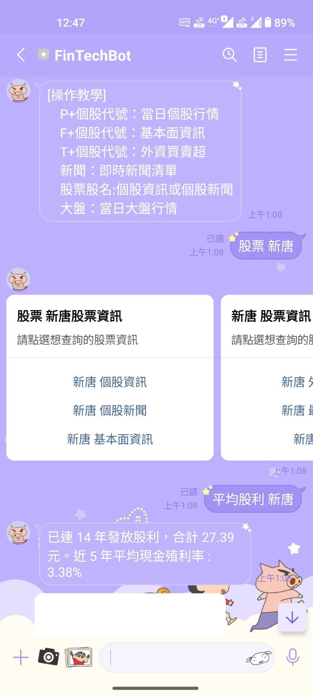

# StockBot
- 結合多個股市資料網站和API，透過Line作為介面，建⽴股市的聊天機器⼈，快速查詢想要的股市資料。

### 資料來源
#### API
1. 臺灣證券交易所OpenAPI
2. FinMind API
3. cnyes API
### 爬蟲
1. Goodinfo台灣股市資訊網
2. Yahoo! 股市
3. 鉅亨網

### 部署
- Heroku

### 功能
- 前日大盤
- 股市新聞TOP10
- 創立關注股票列表
- 個股資訊、新聞、平均股利、歷年股利、獲利能力、同業比較、大戶籌碼
- 個股分鐘圖、日線圖  

